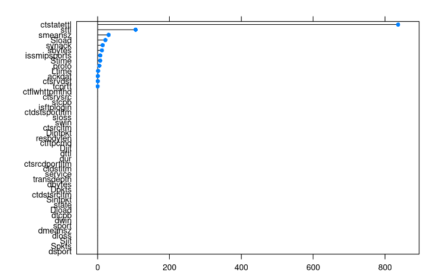

```{r setup, include=FALSE}
knitr::opts_chunk$set(echo = TRUE)

library("jsonlite", warn.conflicts = FALSE)
library("ggplot2", warn.conflicts = FALSE)
library("lattice", warn.conflicts = FALSE)
library("caret", warn.conflicts = FALSE)
library("gbm", warn.conflicts = FALSE)
library("pROC", warn.conflicts = FALSE)

set.seed(42)
```

# Detección de ataques con aprendizaje supervisado

El siguiente ejercicio consiste en crear un modelo entrenado capaz de detectar ataques a partir de logs de un firewall.
Para este propósito, se realizará una prueba de concepto con una pequeña muestra de logs previamente etiquetados como tráfico normal o ataque.

## Data sets

Se proporcionan los siguentes archivos:

 - features.csv
 - events.csv

```{r tidy_data, echo=FALSE}
if (!dir.exists("data")) dir.create("data")
if (!dir.exists("data/raw")) dir.create("data/raw")


# Read only some sample events
#events <- read.csv("data/raw/events_sample.csv")


## Read all events but work with a sample set
#events_origin <- read.csv("data/raw/events.csv")
#events <-  dplyr::sample_frac(events_origin, 0.001)


## Definitive approach with all the events
events <- read.csv("data/raw/events.csv")

features <- read.csv("data/raw/features.csv")
```

### Events analysis

Para estudiar los eventos es importante tener claro el significado de cada una de los campos de los mismos:

```{r events_stats, echo=FALSE}
features
```
Con esta información en mente, podemos hacer un análisis superficial y empezar a trabajar en la limpieza de los datos (de la que hablaremos mas adelante).


Por otro lado, al hacer una exploración visual, no detectamos muchos campos con muchos errores (NAN, NULLS, etc.) por lo tanto no realizaremos una limpieza exhaustiva. Es importante tener en cuenta que es probable que estos datos hayan sido preprocesados debido a la calidad de los mismos.

Se detectan dos particularidades principales, por un lado el campo "service" presenta un elevado número de NAs (mas del 50%), lo que nos recomienda no trabajar con él.

```{r events_stats_service, echo=FALSE}
levels(events$service) <- c(levels(events$service), "invalid") 
events$service[is.na(events$service)] <- "invalid"
prop.table(table(events$service))

```

Por otro lado, la diferencia, normal, cuando estamos trabajando con eventos de distintos protocolos. Debido a las significativas diferencias entre los distintos protocolos, seria interesante estudiarlos por separado si quisieramos tener insights con mucho mas detalle. Se hace este apunte para remarcar que las informaciones  pueden diferir mucho entre unos y otros.
Especialmente entre el grupo TCP y UDP y los demás, De todas formas, asumiendo que un 98% del tráfico es TCP+UDP, trabajaremos con todo el dataset.
```{r events_stats_protocol, echo=FALSE}

ggplot(as.data.frame(events$proto)) +
  aes(x = data) +
  geom_bar(position = "dodge", fill = "#228B22") +
  labs(title = "Events by protocol") +
  theme_minimal()

```

### Datos "a no tener en cuenta"
Hay algunos datos, que por su naturaleza, es recomendable quitar del análisis del modelo para evitar falsos positivos, vamos a verlos.

#### attack_cat
Este campo es un campo calculado "a posteriori", en el que se indica, en caso de ser un ataque, que tipo de ataque es. Por lo tanto por su propia definición tendrá un accuracy del 100%. Pero 

#### srcip
Este campo, que indica la IP origen del ataque, es un campo que no nos ayuda a predecir a futuro, pero si nos puede ensuciar, fácilmente, el pasado. Este campo sería muy útil para hacer un análisis forense de un ataque, pero muy poco útil para predecir futuros ataques.

#### dstip
Este campo, que indica la IP a las que se le han realizado los ataques (nuestras IPs), tampoco nos ayuda a predecir a futuro, en todo caso, podríamos analizar qué IPs reciben mas intentos de ataque, pero no es el objetivo de este modelo.

### Datos significativamente importantes

Al lanzar algunas simulaciones, recibimos información sobre qué correlaciones son mas altas, (mas adelante entraremos mas al detalle, pero es importante plantear algunas preguntas en este punto.)

#### ctstatettl

Este campo, (ct state ttl), tal y como nos indica la tabla de referencia, es un valor calculado. Por lo tanto podría ser suceptible de estar calculado a posteriori añadiendo información de la que no se dispone al instante. 
Los campos calculados pueden añadir una probabilidad de error mas alta, que un campo que es una pura observación.

Para decidir si es un dato imprescindible o no, será interesante trabajar tanto "con" como "sin" este dato.




### Data enrichment
Al realizar los distintos entrenados del modelo hemos detectado un éxito alto, por lo que no ha sido necesario añadir datos de otras fuentes.
Sin embargo hay algunos datos externos con los que seria interesante trabajar para sacar conclusiones que puedan ayudar incluso mas al análisis. Por ejemplo determinar si geográficamente hay alguna relación entre las IPs orígenes que nos estan realizando los ataques, o si hay relación en cuanto al propietario. O incluso analizar versiones de SOs, frameworks, servidores... para determinar si algunos son mas suceptibles de ataque que otros, para definir acciones de mitigación incluso antes de qué los ataques sucedan.

## Feature engineering

```{r prepare_Label, echo=FALSE}

# Etiquetamos la columna Label con valores categoricos
# Separado a un chunk independiente para no sobreescribir datos
events$Label <- ifelse(events$Label == 1, "ATTACK", "NORMAL")
events$Label <- as.factor(events$Label)
```

Al realizar distintos entrenamientos del modelo detectamos algunos campos que nos "engañan" y otros que por si solos ya nos ofrecen soluciones con una alta precisión. 
Para incorporar este conocimiento se han realizado approaches distintos al seleccionar que datos se trabajan en el entrenamiento.
Empezando por un approach genérico de eliminar datos que inducian a errores significativos (como el ya mencionado attackcat) o que limitan el uso del modelo para futuros usos (como srcip, dstip).
Una vez realizada esta "limpieza" se ha procedido a una aproximación mucho mas específica con los datos que mejores resultados han reportado en distintos entrenamientos (ctstatettl, smeansz, sbytes, ackdat...).

```{r feat_eng, echo=FALSE}
# El modelo requiere nombres de columna simples y features numericas o factor
names(events) <- stringr::str_replace_all(names(events), "_", "")
events <- as.data.frame(unclass(events), stringsAsFactors = TRUE)


outcomeName <- 'Label'

excludedCols <- c("Label","attackcat", "ctstatettl", "srcip", "dstip")
predictorsNames <- subset(names(events), !(names(events) %in% excludedCols))

selectedCols <- c("smeansz", "sbytes", "ackdat", "proto")
predictorsNames <- subset(names(events), (names(events) %in% selectedCols))


prop.table(table(events$Label))
```

## Build model

### Create train and test data sets

```{r train_test, echo=FALSE}
# To do: Canviar la p
splitIndex <- createDataPartition(events[,outcomeName], p = .75, list = FALSE, times = 1)
trainDF <- events[ splitIndex,]
testDF  <- events[-splitIndex,]

```

### Model definition

```{r model_config, echo=FALSE}
# To do: Canviar el number
objControl <- trainControl(method = 'cv', 
                           number = 3, 
                           returnResamp = 'none', 
                           summaryFunction = twoClassSummary, 
                           classProbs = TRUE)
```

### Train model

```{r model_train, echo=FALSE}
objModel <- train(trainDF[,predictorsNames], trainDF[,outcomeName], 
                  method='gbm', 
                  trControl=objControl,  
                  metric = "ROC",
                  preProc = c("center", "scale"))
summary(objModel)
```

### Test model

```{r model_test, echo=FALSE}
predictions <- predict(object = objModel, testDF[, predictorsNames], type = 'raw')
head(predictions)

```

## Evaluate model

```{r model_eval, echo=FALSE}
print(postResample(pred=predictions, obs=as.factor(testDF[,outcomeName])))

```


```{r predic_prob}
# probabilites 
predictions <- predict(object=objModel, testDF[,predictorsNames], type='prob')
auc <- roc(ifelse(testDF[,outcomeName]=="ATTACK",1,0), predictions[[2]])
print(auc$auc)
```


```{r var_importance}
plot(varImp(objModel,scale=F))
```


## Conclusion

Podemos concluir que el dataset nos permite hacer predicciones muy precisas, con ciertamente pocos datos.
El campo "ctstatettl" nos da una precisión altísima, pero por desconocimiento del cálculo (y de la fiabilidad del mismo) para generar este dato, se ha optado por utilizar otros campos que tambien otorgan una fiabilidad muy alta.

Por lo tanto, podemos concluir que, con relativamente pocos datos somos capaces de determinar si ciertas conexiones forman parte de un ataque o no.

Como hemos comentado en puntos anteriores, seria interesante hacer enrichment de los datos, para poder detectar incluso con mas celeridad cualquier ataque, qué destinos se han estado atacando (identificando OSs, servicios expuestos, etc.). Esta información podria recopilarse tanto de forma públicamente accesible (cabeceras o respuestas a errores) como internamente (a partir de la definición de loas distintos assets).


```{r conclusion, echo=FALSE}


```
